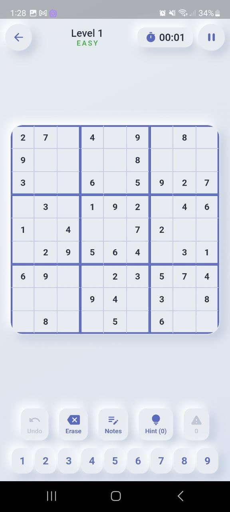
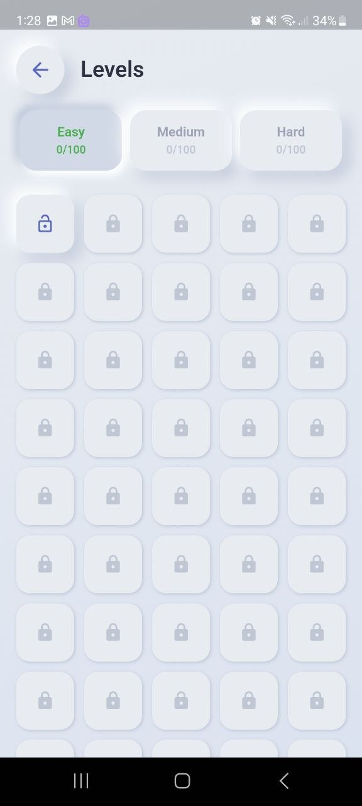
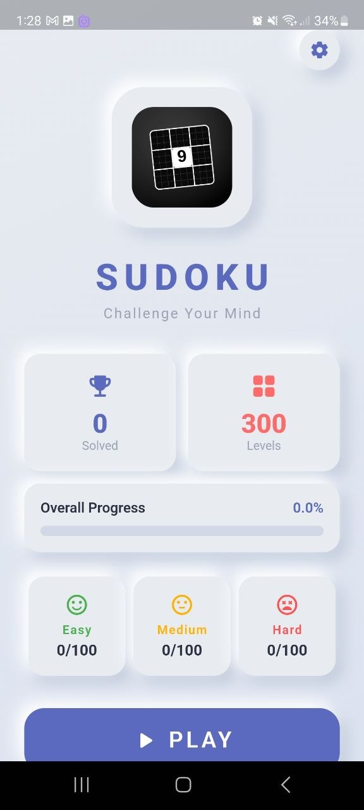

# Sudoku — 300+ Levels

A beautifully crafted Sudoku game for Android built with Flutter, featuring a **neumorphic design system**, **300 procedurally generated puzzles** across three difficulty levels, and a polished gameplay experience.

Built from scratch — no third-party Sudoku libraries. The engine, UI, and level system are all custom.

---

## Screenshots

<p align="center">
  
  
  
</p>

| Home | Gameplay | Levels |
|:---:|:---:|:---:|
| Neumorphic design with logo, stats dashboard, progress bar, difficulty breakdown | 9×9 board with thick 3×3 box borders, number pad, game controls, timer | 5-column grid with stars, unlock status, difficulty tabs |

---

## Features

### 300 Levels
- **100 Easy**, **100 Medium**, **100 Hard** — procedurally generated on first launch
- Each puzzle is guaranteed to have a **unique solution**
- Difficulty scales by givens removed:
  | Difficulty | Cells Removed | Givens |
  |---|---|---|
  | Easy | 36–40 | 45–41 |
  | Medium | 42–48 | 39–33 |
  | Hard | 49–54 | 32–27 |

### Home Screen
- **Custom logo display** — app logo shown inside a neumorphic container with animated scale pulse
- **Stats dashboard** — total solved count, overall progress bar with percentage
- **Per-difficulty breakdown** — Easy/Medium/Hard cards with solved counts and emoji icons
- **All Complete badge** — celebratory banner when all 300 puzzles are solved
- **Continue shortcut** — one-tap resume at the next unsolved level

### Back Navigation
- **PopScope on every screen** — Android system back button navigates to the previous screen instead of exiting the app
- Game screen → back goes to levels | Level select → back goes to home | Home screen → stays (doesn't exit)

### Puzzle Engine (`lib/engine/sudoku_engine.dart`)
- **Backtracking generator** — fills a complete valid grid with randomized number order
- **Uniqueness validator** — counts solutions and rejects puzzles with multiple solutions
- **Conflict detection** — finds row/column/box duplicates in real-time
- **Completion checker** — validates the entire board on every move
- **Hint system** — computes all empty cells that differ from the solution
- **Serialization** — grids stored as compact 81-character strings for persistence

### Neumorphic Design System (`lib/core/theme/neumorphic.dart`)
- Custom **dual-shadow** neumorphic widgets — no external UI kit dependency
- **Convex** (raised) and **concave** (pressed/inset) shadow presets
- **NeumoButton** — animated press state with smooth 100ms transitions
- **NeumoIconButton** — circular variant for toolbar actions
- Color-tinted shadows for difficulty-specific theming
- Consistent surface language across home, level picker, and game screens

### Gameplay
- **Timer** with pause — tracks solve time per puzzle
- **Undo stack** — unlimited undo with note state restoration
- **Pencil marks / Notes mode** — toggle to annotate candidates per cell
- **Hint system** — fills the correct value in the selected (or first empty) cell
- **Mistake counter** — tracks wrong number placements
- **Conflict highlighting** — red cells for duplicates in row/column/box
- **Same-number highlighting** — all cells with the selected number light up
- **Same-box shading** — the 3×3 box of the selected cell is subtly tinted
- **Given vs. user** — bold dark for puzzle givens, colored for user entries

### Completion & Progress
- **Star rating** — 1–3 stars based on solve time per difficulty:
  | | 3 Stars | 2 Stars | 1 Star |
  |---|---|---|---|
  | Easy | ≤ 3 min | ≤ 6 min | > 6 min |
  | Medium | ≤ 5 min | ≤ 10 min | > 10 min |
  | Hard | ≤ 8 min | ≤ 15 min | > 15 min |
- **Victory dialog** — shows stars, time, hints used, and mistakes
- **Next level** — one-tap jump to the following puzzle
- **Progress persistence** — solved status, best time, and stars saved via SharedPreferences
- **Solved counters** — per-difficulty progress shown on level select screen
- **All 300 complete celebration** — confetti animation with 120 colorful particles and "Sudoku Master" congratulations when every puzzle is solved

### Level Select
- **Difficulty tabs** — Easy / Medium / Hard with animated neumorphic toggle
- **5-column grid** — 100 levels per page, scrollable
- **Lock/unlock** — levels unlock sequentially (solve N to access N+1)
- **Status indicators** — lock icon, star row, and best time on each tile
- **Continue button** — home screen shortcut jumps to the next unsolved level

### Navigation (GoRouter)
| Route | Screen |
|---|---|
| `/` | Home — animated logo, Play & Continue |
| `/levels` | Level browser with difficulty tabs |
| `/game/:id` | Gameplay for a specific level |
| `/continue` | Resume at next unsolved level |

### Visual Details
- **Poppins** for headings, **Inter** for body — via Google Fonts
- **Warm grey gradient** background (`#E8ECF1` → `#DCE3F0`)
- **Deep indigo** primary (`#5B6ABF`), **coral** accent (`#FF6B6B`)
- Difficulty colors: green (Easy), amber (Medium), red (Hard)
- **Animated logo** on home screen — subtle scale pulse with a demo board
- Tabular figures for timer — digits don't jump as time changes
- Material Icons tree-shaken from 1.6MB → 3KB (99.8% reduction)

---

## Project Structure

```
lib/
├── main.dart                          # Entry point — inits SharedPreferences + generates puzzles
├── app.dart                           # MaterialApp.router + GoRouter config
├── core/
│   ├── constants.dart                 # Grid size, difficulty labels, level counts
│   └── theme/
│       ├── app_colors.dart            # 25+ semantic color constants
│       ├── app_theme.dart             # ThemeData with Poppins/Inter typography
│       └── neumorphic.dart            # Neumo, NeumoButton, NeumoIconButton widgets
├── engine/
│   └── sudoku_engine.dart            # Generator, solver, uniqueness validator, serializer
├── services/
│   └── level_service.dart            # 300-puzzle generation, CRUD, progress tracking
├── screens/
│   ├── home_screen.dart              # Animated landing page
│   ├── level_select_screen.dart      # Difficulty tabs + level grid
│   └── game_screen.dart              # Full gameplay with timer + controls
└── widgets/
    ├── sudoku_board.dart             # 9×9 neumorphic grid with highlighting
    ├── number_pad.dart               # Neumorphic 1–9 input row
    ├── game_controls.dart            # Undo, Erase, Notes, Hint, Mistakes belt
    └── confetti_overlay.dart         # 120-particle celebration on all-levels-complete
```

---

## Tech Stack

| Layer | Technology |
|---|---|
| Framework | Flutter 3.24 (Dart 3.5) |
| Navigation | GoRouter 14 |
| State | StatefulWidget + setState |
| Persistence | SharedPreferences |
| Fonts | Google Fonts (Poppins, Inter) |
| Target | Android (APK) |

---

## Build

```bash
# Get dependencies
flutter pub get

# Analyze
dart analyze lib/

# Build release APK
flutter build apk --release

# Output
# build/app/outputs/flutter-apk/app-release.apk (~20.7 MB)
```

**Analysis status:** 0 errors, 0 warnings.

---

## How It Works

### Puzzle Generation
1. **Fill grid** — backtracking algorithm fills a 9×9 grid with numbers 1–9 in randomized order, respecting row/column/box constraints
2. **Remove cells** — randomly removes cells one at a time
3. **Check uniqueness** — after each removal, counts solutions (stops at 2). If multiple solutions exist, the cell is restored
4. **Repeat** — continues until the target number of cells is removed
5. **Store** — solution and puzzle are serialized as 81-character strings and saved to SharedPreferences

### First Launch
On first launch, all 300 puzzles are generated and stored. Subsequent launches load instantly from SharedPreferences. Generation takes ~2–5 seconds total.

---

## License

MIT — free to use, modify, and distribute.
